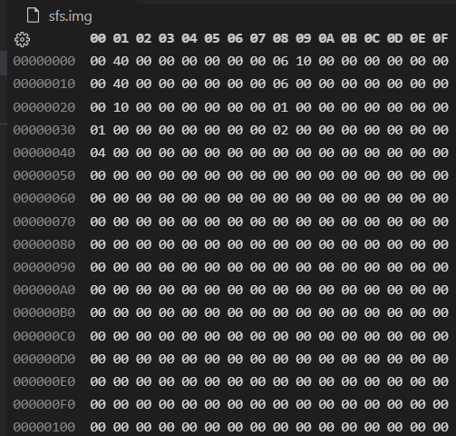

# SFS

SFS（Simple File System）是一个基于fuse3（用户态文件系统）实现的简单的类UFS文件系统。

## Environment

- Ubuntu 22.04 LTS
- gcc 11.2.0
- gdb 12.1
- fuse3

## How to use?

本项目结构如下：

```

SFS/
├── build
│   ├── testmount
│   ├── sfs
│   └── sfs.o
├── img
│   └── sfsimg.png
├── makefile
├── README.md
├── sfs_ds.h
├── sfs_rw.h
├── sfs_utils.h
├── sfs.c
└── sfs.img

```


在SFS目录下，初始化一个8M大小的全0虚拟磁盘

```bash
dd bs=1K count=8K if=/dev/zero of=sfs.img
```

编译执行

```bash
mkdir build # 若不存在build目录
make
```

此时build目录内会生成可执行文件，在build目录内创建一个空文件夹用于挂载文件系统

```bash
cd build
mkdir testmount # 若不存在testmount目录
```

挂载文件系统（运行文件系统后会自动检查虚拟磁盘是否已进行格式化）

```bash
./sfs -d testmount
```

卸载文件系统

```bash
fusermount -u testmount
```

## Tips

VSCode安装Hex Editor插件，右键点击sfs.img选择打开方式，选择Hex Editor，就可以查看该虚拟磁盘映像文件的内容，方便调试。

